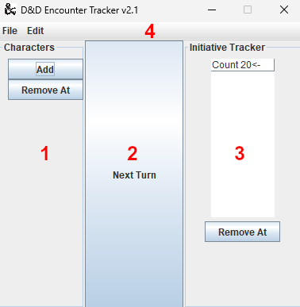
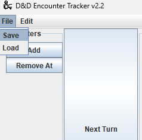
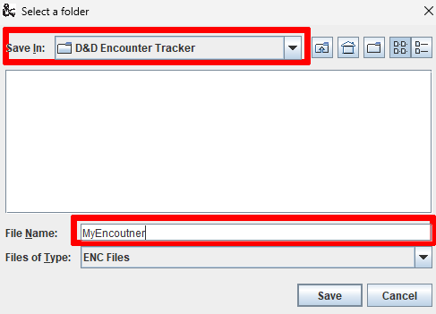
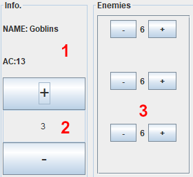

# D&D Encounter Tracker
Initiative tracker built for combat-based TTRPG games (mainly Dungeons & Dragons) to simplify the old notepad process I used to do when I ran combat encounters.
Plug in your fighters, customize your enemies, and get tracking!

## Requirements
* Java 11 or later

# Program Breakdown

1. Character List

List of characters (players/enemies) that could join the battle

2. Next Turn button

Moves the current turn (<-) to the next fighter

3. Initiative Tracker

Fighters in active combat. Automatically sorted by Initiative roll.

4. Menubar

Includes options to save, load, and clear

# Use Guide
## Adding Characters
1. To add your fighters, click the "Add" button in the Character list.
2. Enter the name of the character in the popup and click "OK".
3. To add your character to the tracker (active combat), double click on their name in the character list.

## Starting Combat
1. When adding your character to combat, type in the initiative roll of that combatant into the popup.
2. Select whether the combatant is a player or enemy in the next popup. (Enemy management will be covered in a later section).

>To view the roll of a combatant, right click on that combatant in the Initiative Tracker and select "Show Roll #".

3. An arrow (←) will appear next to the current figher
4. Click the "Next Turn" button to move the arrow to the next combatant's turn.

## Menubar Functions
### Saving
1. To save an encounter, click the "File" option in the menubar and select "Save".

2. A directory prompt will appear. Navigate to the folder where you want to save your encounter.
3. Give your encounter a name and select "Save".

### Loading
1. Loading is similar to saving. Select "Load" from the menubar instead.
2. A directory prompt will open. Select your encounter (.enc) file and select "Open".

### Clearing
1. To clear either side of the program, or both. Select the "Edit" option in the menubar.
2. Select the "Clear Option".
3. A prompt will appear asking if you want to clear the Character List, Initiative Tracker, or Both. Select your option to clear the program.
> You will not be prompted to save before clearing, so make sure to do so beforehand!

## The Enemy Manager
For enemy combatants (see Starting Combat, step 2), you can use the built-in enemy manager to readily keep track of different things:

* Armor Class
* Number of enemies
* Health of each enemy

To access the enemy manager, right click on an enemy in the Initiative Tracker and select "Open in Enemy Manager".

1. Name and AC

The name and Armor Class (AC) of the enemy unit.

2. Active Number

Number of individual enemies in this unit.

3. Health Manager

Current health of each enemy in the unit.

### Setting Up
1. Right click on an enemy in the Initiative Tracker and select "Open in Enemy Manager".
2. Enter the enemy's health and AC into the popups.
3. To add enemies to the unit, select the "+" button to the Active Number. You can also remove units by pressing the "-" button.

### Health Management
Each enemy is given the average health points (HP) given to the manager. You can increase or decrease this number by clicking the "+" or "-" buttons.
1. To increase or decrease an enemy's HP, press the "+" or "-" button next to their health number.
2. To quickly add or remove larger portions of health, double click on the HP number of that enemy.
3. In the popup, enter the amount to add or remove.
> To remove health, enter a negative number (i.e. -12, -24)